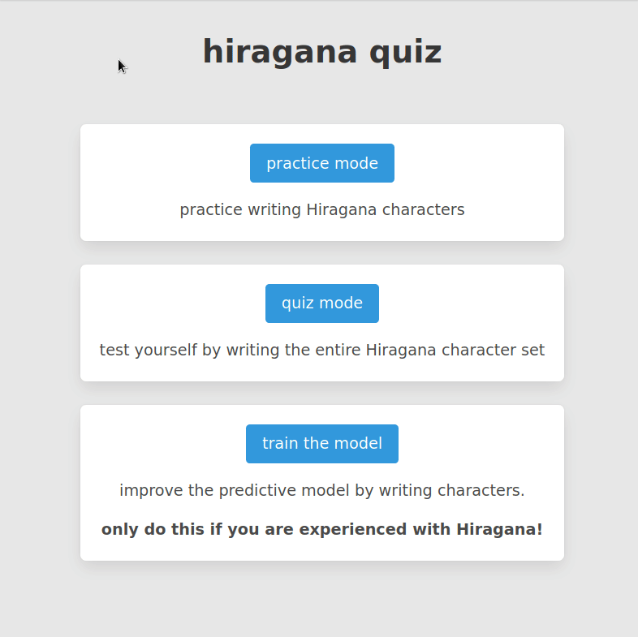
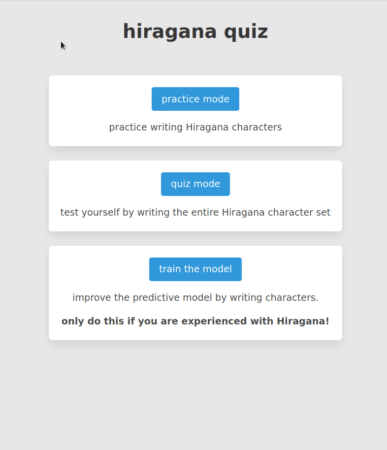
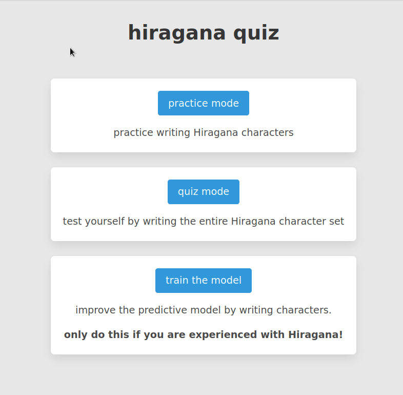

# kana quiz

a machine learning web app that helps users practice writing Hiragana characters (one of the character sets used in the Japanese language)

---

## demo

### 1) practice mode


### 2) quiz mode


### 3) training mode


---

## run on your machine

### 1) environment setup
* clone the repo
* create and start a virtual environment (optional)
* install modules:
    ```
    pip install -r requirements.txt
    ```

### 2) app setup
* compile training data:
    ```
    python scripts/build_data_file.py
    ```
* build the ML model:
    ```
    python scripts/train_model.py
    ```
* run the app:
    ```
    python app.py
    ```
* go to [localhost:5000](http://localhost:5000)

### 3) useful scripts
* `scripts/build_data_file.py`
    * combines data files in **data/** into a single file
* `scripts/sep_data_fil.py`
    * separates **data.csv** into multiple files
    * this was done just so i could push the files to GitHub
* `scripts/train_model.py`
    * uses **data.csv** and builds the ML model 
* `scripts/model_testing.py`
    * shows the out-of-sample score for the ML model
    * use this to test hyperparameters / other models
* `scripts/data_distribution.py`
    * shows the distribution of instances within the dataset
    * ideally, this should be uniform across the 46 characters

---

## other notes

* the ML model / quiz only uses the basic Hiragana characters. I didn't wanna mess with diacritics (Gs, Zs, Ds, Bs, and Ps)
* i'm the only one who trained this model (so far), so it might be hypersensitive to my handwriting